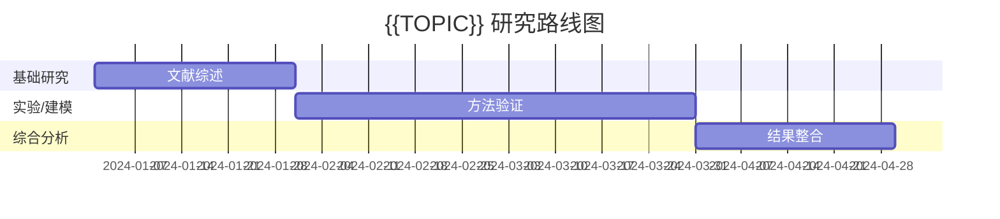

# {{TOPIC}} 学术综合分析

日期：{{DATE}}
来源：对话/工作会话
置信度：INFERRED

## 核心洞见

<!-- 3-5 条关键洞见，每条一行 -->

## 关键决策

<!-- 做了什么决定，为什么这么决定 -->

## 方法对比表

<!-- 如果涉及多文献的方法对比，使用 Markdown 表格 -->

| 方法/文献 | 优点 | 缺点 | 适用场景 | 可重复性 |
|-----------|------|------|----------|----------|
| 方法A     | ...  | ...  | ...      | 高       |
| 方法B     | ...  | ...  | ...      | 中       |

## 研究路线图

## 未来工作建议

<!-- 基于现有文献提出的下一步研究方向 -->

1. 
2. 
3. 

## 涉及概念

<!-- 列出本次分析涉及的重要概念，每个用 [[概念名]] 格式链接 -->

## 参考资料

<!-- 分析中引用的文献、工具、项目 -->

## 待跟进

<!-- 还没解决的问题，或者下一步要验证的假设 -->
