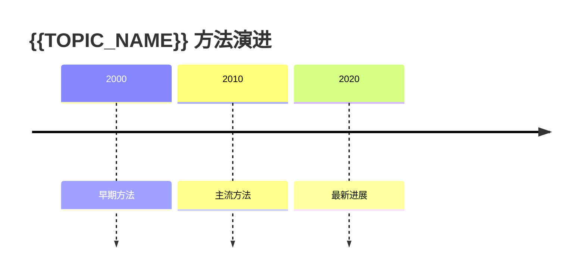

# {{TOPIC_NAME}}

> 一句话概括这个主题的核心问题或研究方向

## 核心观点

（从多个文献中综合出来的关于这个主题的核心认知）

## 研究现状

（这个主题在国际/国内的研究进展概述）

## 方法演进时间线

## 文献汇总

（列出所有讨论过这个主题的文献，标注每篇的核心贡献）

| 文献 | 核心贡献 | 详见 |
|------|----------|------|
| （文献名） | （一句话） | [[文献摘要页]] |

## 关键概念与方法

（这个主题涉及的关键概念和方法，链接到对应页面）

- [[entities/概念1]] — 简要说明
- [[methods/方法1]] — 简要说明

## 争议点

（不同文献之间存在分歧的地方）

## 未解决的问题

（文献中提到但没有答案的问题，或该领域的开放问题）

## 相关页面
